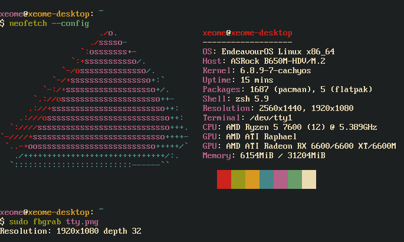

<h3 align="center">
	 
	
	Catppuccin+Gruvbox for TTY (forked from catppuccin)
</h3>

  

## Usage

Use original [catppuccin](https://github.com/catppuccin/tty) if you just want catppuccin theme. This one works aswell but it won't be updated. Its main purpose is to provide gruvbox tty theme.

1. Clone this repo.
2. Run `./generate.sh <theme>` (eg `./generate.sh gruvbox`)
3. Copy the text it outputs and set it in your kernel options
4. Restart your computer

### GRUB

1. Edit `/etc/default/grub` and append to the `GRUB_CMDLINE_LINUX` string
2. Run `sudo update-grub`
    - If your system doesn't have that, instead run `sudo grub-mkconfig -o /boot/grub/grub.cfg`

### systemd-boot

1. Edit the boot entry located in `/boot/loader/entries/`
2. Append to the `options` line
3. Run `sudo bootctl update`

### Limine

1. Edit `/boot/limine.cfg`
2. Append to the boot entry's `CMDLINE` line

### Other

For other bootloaders or for more information, [see here on ArchWiki](https://wiki.archlinux.org/title/Kernel_parameters)

## 💝 Thanks to

- [Echo](https://github.com/CallMeEchoCodes)
- [mekb](https://github.com/mekb-turtle)

&nbsp;

	

